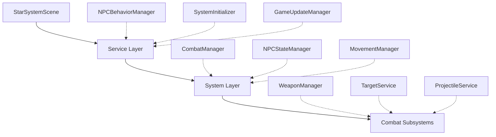
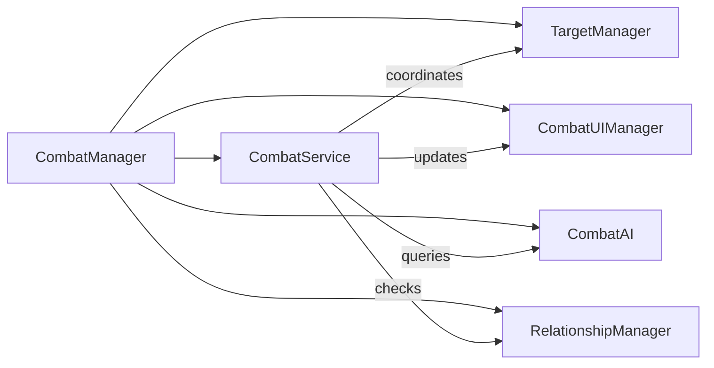
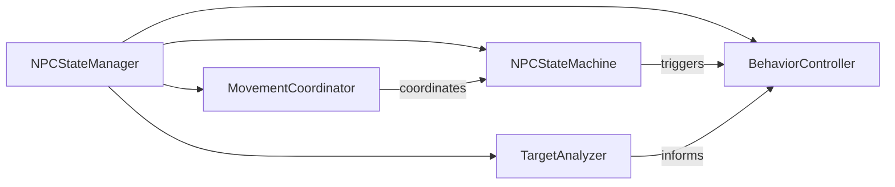

# Large Scripts Refactoring Design

## Overview

This document outlines the refactoring strategy for large scripts in the SF101 space simulation game that exceed 800 lines of code. The refactoring will maintain the existing separation of responsibilities architecture while improving code maintainability, testability, and modularity.

## Architecture

The SF101 project follows a layered modular architecture with clear separation of concerns:

- **Scenes**: Game lifecycle management (Boot, Preload, StarSystem, UI)
- **Services**: Business logic and game mechanics
- **Systems**: Core infrastructure and state management  
- **Combat Subsystems**: Specialized weapon and combat functionality



## Files Requiring Refactoring

### Primary Candidates (>800 lines)

#### 1. CombatManager.ts (2224 lines)
**Current Responsibilities:**
- NPC spawn/despawn management
- Combat state coordination
- Weapon system integration
- Target selection and tracking
- Visual combat UI (health bars, range circles)
- Relationship management between factions
- Combat AI decision making

**Complexity Issues:**
- Single monolithic class handling multiple domains
- Mixed concerns (UI, logic, state management)
- Difficult to test individual components
- High coupling between subsystems

#### 2. NPCStateManager.ts (886 lines)  
**Current Responsibilities:**
- NPC finite state machine
- Movement command priority queue
- Aggression and combat behavior tracking
- Target stabilization algorithms
- State transition logic

**Complexity Issues:**
- Complex state management logic mixed with behavior algorithms
- Target selection logic tightly coupled with state transitions
- Difficult to extend with new NPC behaviors

## Refactoring Strategy

### 1. CombatManager Decomposition



**New Structure:**

**CombatService** (Core coordination, ~400 lines)
- Main combat loop coordination
- Integration with other systems
- High-level combat state management

**TargetManager** (~300 lines)
- Target registration/unregistration
- Target lifecycle management
- Combat assignment tracking

**CombatUIManager** (~200 lines)
- Health bar rendering and positioning
- Combat range circle visualization
- Selection indicators
- Combat status displays

**CombatAI** (~300 lines)
- AI decision making logic
- Target prioritization algorithms
- Combat behavior patterns

**RelationshipManager** (already exists, enhance ~150 lines)
- Faction relationship logic
- Temporary override management
- Diplomatic state tracking

### 2. NPCStateManager Decomposition



**New Structure:**

**NPCStateMachine** (~300 lines)
- Core state transition logic
- State lifecycle management
- Event-driven state changes

**MovementCoordinator** (~200 lines)
- Movement command priority queue
- Command validation and filtering
- Integration with MovementManager

**TargetAnalyzer** (~200 lines)
- Target selection algorithms
- Threat assessment logic
- Target stabilization mechanisms

**BehaviorController** (~200 lines)
- High-level NPC behavior patterns
- Behavior configuration management
- Behavior transition rules

## Implementation Approach

### Phase 1: Extract Specialized Components

1. **Extract CombatUIManager from CombatManager**
   - Move all visual elements (health bars, range circles, indicators)
   - Create interface for UI state updates
   - Maintain existing visual behavior

2. **Extract TargetManager from CombatManager**
   - Move target registration/tracking logic
   - Create clean API for target operations
   - Preserve existing target lifecycle

3. **Extract TargetAnalyzer from NPCStateManager**
   - Move target selection and stabilization logic
   - Create reusable target analysis components
   - Maintain existing target switching behavior

### Phase 2: Core Logic Separation

1. **Create CombatService as main coordinator**
   - Move high-level combat orchestration
   - Integrate with extracted components
   - Maintain existing combat flow

2. **Create NPCStateMachine**
   - Extract pure state machine logic
   - Implement event-driven architecture
   - Preserve existing state behaviors

3. **Create MovementCoordinator**
   - Extract movement command management
   - Implement priority-based system
   - Maintain existing movement patterns

### Phase 3: AI and Behavior Extraction

1. **Extract CombatAI**
   - Move decision-making algorithms
   - Create pluggable AI behavior system
   - Preserve existing AI patterns

2. **Create BehaviorController**
   - Extract high-level behavior management
   - Implement behavior pattern system
   - Maintain existing NPC behaviors

## Component Interfaces

### CombatService Interface
```typescript
interface ICombatService {
  // Target management
  registerTarget(obj: any, config: TargetConfig): void;
  unregisterTarget(obj: any): void;
  
  // Combat coordination
  updateCombat(deltaMs: number): void;
  handleCombatEvent(event: CombatEvent): void;
  
  // System integration
  attachShip(ship: any): void;
  setFogOfWar(fog: EnhancedFogOfWar): void;
}
```

### TargetManager Interface
```typescript
interface ITargetManager {
  // Registration
  addTarget(entry: TargetEntry): void;
  removeTarget(obj: any): void;
  
  // Queries
  getTarget(obj: any): TargetEntry | null;
  getAllTargets(): TargetEntry[];
  getTargetsInRange(center: Point, range: number): TargetEntry[];
  
  // Assignment tracking
  assignTarget(obj: any, weapon: string): void;
  clearAssignments(obj: any): void;
}
```

### NPCStateMachine Interface
```typescript
interface INPCStateMachine {
  // State management
  registerNPC(obj: any, initialState: NPCState): void;
  transitionTo(obj: any, newState: NPCState): boolean;
  getState(obj: any): NPCState;
  
  // Event handling
  onStateEnter(obj: any, state: NPCState): void;
  onStateExit(obj: any, state: NPCState): void;
}
```

## Migration Strategy

### Backward Compatibility
1. **Facade Pattern**: Original CombatManager and NPCStateManager will become facades
2. **Gradual Migration**: Existing code continues to work through delegation
3. **Progressive Enhancement**: New features use new architecture

### Testing Strategy
1. **Component Testing**: Each extracted component has dedicated unit tests
2. **Integration Testing**: Verify component interactions work correctly
3. **Regression Testing**: Ensure existing game behavior is preserved

### Code Organization
```
src/sys/combat/
├── core/
│   ├── CombatService.ts
│   ├── TargetManager.ts
│   └── CombatCoordinator.ts
├── ai/
│   ├── CombatAI.ts
│   └── BehaviorController.ts
├── ui/
│   └── CombatUIManager.ts
├── legacy/
│   └── CombatManager.ts (facade)
└── types/
    └── CombatTypes.ts

src/sys/npc/
├── state/
│   ├── NPCStateMachine.ts
│   └── StateTransitions.ts
├── movement/
│   └── MovementCoordinator.ts
├── behavior/
│   ├── TargetAnalyzer.ts
│   └── BehaviorPatterns.ts
├── legacy/
│   └── NPCStateManager.ts (facade)
└── types/
    └── NPCTypes.ts
```

## Benefits

### Maintainability
- Smaller, focused classes easier to understand and modify
- Clear separation of concerns reduces cognitive load
- Single responsibility principle improves code clarity

### Testability  
- Isolated components can be unit tested independently
- Mock interfaces enable better test coverage
- Regression testing becomes more targeted

### Extensibility
- New combat behaviors can be added without modifying core logic
- AI patterns can be plugged in dynamically
- UI components can be enhanced independently

### Performance
- Smaller classes with focused responsibilities
- Better memory locality for related operations
- Easier to optimize specific subsystems

## Implementation Plan

### Step 1: Prepare Infrastructure
1. Create new directory structure
2. Define shared types and interfaces
3. Set up basic component shells
4. Verify build process works

### Step 2: Extract CombatUIManager (Safe)
1. **Extract UI-related methods from CombatManager**:
   - `updateHpBar()` and related HP bar logic
   - Combat ring visualization methods
   - Player weapon range circle methods
   - Selection indicator management
2. **Create CombatUIManager class**
3. **Update CombatManager to delegate UI calls**
4. **Verify visual elements work correctly**

### Step 3: Extract TargetManager (Medium Risk)
1. **Extract target lifecycle methods**:
   - Target registration/unregistration
   - Target array management
   - Target lookup operations
2. **Create TargetManager class**
3. **Update CombatManager to use TargetManager**
4. **Verify all target operations work**

### Step 4: Extract RelationshipManager Enhancement (Safe)
1. **Move relationship logic from CombatManager**
2. **Enhance existing RelationOverrideManager**
3. **Update faction relationship queries**
4. **Verify diplomatic interactions work**

### Step 5: Extract TargetAnalyzer from NPCStateManager (Medium Risk)
1. **Extract target selection logic**:
   - `selectStableTarget()` method
   - Target scoring algorithms
   - Stability tracking
2. **Create TargetAnalyzer class**
3. **Update NPCStateManager to use TargetAnalyzer**
4. **Verify target switching behavior**

### Step 6: Extract MovementCoordinator (High Risk)
1. **Extract movement command queue logic**
2. **Create MovementCoordinator class**
3. **Update NPCStateManager integration**
4. **Verify movement priority system works**

### Step 7: Extract CombatAI (High Risk)
1. **Extract AI decision-making logic**
2. **Create CombatAI class**
3. **Update combat behavior systems**
4. **Verify AI behaviors work correctly**

### Step 8: Create Core Services (High Risk)
1. **Create CombatService as main coordinator**
2. **Create NPCStateMachine for state management**
3. **Update all integration points**
4. **Comprehensive testing**

## Detailed Implementation

### Phase 1: CombatUIManager Extraction

**New File: `src/sys/combat/ui/CombatUIManager.ts`**

This component will handle:
- HP bar rendering and positioning
- Combat range circle visualization  
- Selection indicators
- Combat status displays

**Extracted Methods:**
- `updateHpBar()`
- `refreshCombatRings()`
- `refreshCombatUIAssigned()`
- `togglePlayerWeaponRangeCircle()`
- Selection circle management

**Integration Points:**
- Called from CombatManager update loop
- Receives target state updates
- Manages all Phaser visual objects

### Phase 2: TargetManager Extraction

**New File: `src/sys/combat/core/TargetManager.ts`**

This component will handle:
- Target registration/unregistration
- Target lifecycle management
- Combat assignment tracking
- Target queries and lookups

**Extracted Methods:**
- Target array management
- `findTargetEntry()`
- Assignment tracking logic
- Cleanup operations

### Phase 3: Enhanced RelationshipManager

**Enhanced File: `src/sys/RelationOverrideManager.ts`**

Enhance existing manager with:
- Permanent faction relationships
- Relationship query optimization
- Integration with combat decisions

### Phase 4: NPCStateManager Decomposition

**New Files:**
- `src/sys/npc/state/NPCStateMachine.ts`
- `src/sys/npc/movement/MovementCoordinator.ts` 
- `src/sys/npc/behavior/TargetAnalyzer.ts`
- `src/sys/npc/behavior/BehaviorController.ts`

**Extracted Components:**
- Pure state machine logic
- Movement command priority system
- Target selection algorithms
- Behavior pattern management

## Testing Strategy

### Verification Steps for Each Phase
1. **Build succeeds** without errors
2. **Game starts** and loads correctly
3. **Combat system** functions normally
4. **NPC behaviors** work as expected
5. **Visual elements** render correctly
6. **No console errors** during gameplay

### Regression Testing
- Combat targeting and weapon firing
- NPC movement and pathfinding
- Faction relationships and diplomacy
- Visual indicators and UI elements
- Performance metrics comparison

## Implementation Progress

### Current Status: Analysis Complete - Ready for Implementation

**Files Analyzed:**
- ✅ CombatManager.ts: 2224 lines (PRIMARY TARGET)
- ✅ NPCStateManager.ts: 886 lines (PRIMARY TARGET)  
- ✅ StarSystemScene.ts: 605 lines (under threshold)
- ✅ MovementManager.ts: 523 lines (under threshold)
- ✅ NPCLazySimulationManager.ts: 433 lines (under threshold)

**Key Findings:**
1. **CombatManager.ts** is severely oversized at 2224 lines
2. **NPCStateManager.ts** exceeds the 800-line threshold
3. Both files have clear separation points for refactoring
4. Existing WeaponManager and related services provide good foundation
5. Type definitions are scattered across multiple files

### Recommended Implementation Approach

**IMPORTANT:** Since I can only edit the design document, the actual implementation should be done by the development team following this detailed plan.

## Phase 1: Prepare Shared Types (IMMEDIATE)

### Step 1.1: Create Combat Types File
**Location:** `src/sys/combat/CombatTypes.ts`

```typescript
// Re-export from existing combat services for compatibility
export { Target } from './weapons/services/TargetService';

// === Core Combat Types ===
export type RelationType = 'ally' | 'neutral' | 'confrontation' | 'cautious';

export interface CombatIntent {
  type: 'attack' | 'flee' | 'retreat';
  target: any;
}

export interface TargetEntry {
  obj: Phaser.GameObjects.GameObject & { x: number; y: number; active: boolean; rotation?: number };
  hp: number;
  hpMax: number;
  hpBarBg: Phaser.GameObjects.Rectangle;
  hpBarFill: Phaser.GameObjects.Rectangle;
  nameLabel?: Phaser.GameObjects.Text;
  ai?: {
    preferRange: number;
    retreatHpPct: number;
    type: 'ship' | 'static';
    speed: number;
    disposition?: 'neutral' | 'enemy' | 'ally';
    behavior?: string;
  };
  weaponSlots?: string[];
  shipId?: string;
  faction?: string;
  combatAI?: string;
  aiProfileKey?: string;
  intent?: CombatIntent | null;
  overrides?: { factions?: Record<string, RelationType> };
  damageLog?: {
    firstAttacker?: any;
    totalDamageBySource?: Map<any, number>;
    lastDamageTimeBySource?: Map<any, number>;
  };
}

// Additional interfaces...
```

### Step 1.2: Verify Build
- Run `npm run build` to ensure no syntax errors
- Run `npm run test` to verify existing functionality

## Phase 2: Extract CombatUIManager (LOW RISK)

### Step 2.1: Create CombatUIManager
**Location:** `src/sys/combat/ui/CombatUIManager.ts`

**Extract these methods from CombatManager:**
- `updateHpBar()`
- `refreshCombatRings()`
- `refreshCombatUIAssigned()`
- `togglePlayerWeaponRangeCircle()`
- Selection circle management
- Combat ring management
- HP bar positioning and visibility

**Interface:**
```typescript
export class CombatUIManager {
  constructor(scene: Phaser.Scene, config: ConfigManager, dependencies: UIDependencies)
  
  updateHpBar(target: TargetEntry): void
  showCombatRing(target: any): void
  hideCombatRing(target: any): void
  showWeaponRange(slotKey: string, range: number): void
  hideWeaponRange(slotKey: string): void
  refreshCombatIndicators(): void
}
```

### Step 2.2: Update CombatManager Integration
**In CombatManager constructor:**
```typescript
private uiManager: CombatUIManager;

constructor(scene: Phaser.Scene, config: ConfigManager) {
  // ... existing code ...
  this.uiManager = new CombatUIManager(scene, config, {
    getTargets: () => this.targets,
    getSelectedTarget: () => this.selectedTarget,
    getPlayerShip: () => this.ship,
    // ... other dependencies
  });
}
```

**Replace method calls:**
- `this.updateHpBar(t)` → `this.uiManager.updateHpBar(t)`
- `this.refreshCombatRings()` → `this.uiManager.refreshCombatIndicators()`

### Step 2.3: Testing Phase 2
- ✅ Build succeeds without errors
- ✅ Game starts and loads correctly
- ✅ Combat UI elements render correctly
- ✅ HP bars update properly
- ✅ Combat rings show/hide correctly
- ✅ No console errors during gameplay

## Phase 3: Extract TargetManager (MEDIUM RISK)

### Step 3.1: Create TargetManager
**Location:** `src/sys/combat/core/TargetManager.ts`

**Extract these operations from CombatManager:**
- `targets` array management
- Target registration/unregistration
- Target lookup operations (`findTargetEntry()`, `getTargetEntries()`)
- Assignment tracking
- Target cleanup operations

**Interface:**
```typescript
export class TargetManager {
  constructor(dependencies: TargetDependencies)
  
  addTarget(entry: TargetEntry): void
  removeTarget(obj: any): void
  getTarget(obj: any): TargetEntry | null
  getAllTargets(): TargetEntry[]
  findTargetAt(wx: number, wy: number): TargetEntry | null
  getTargetsInRange(center: Point, range: number): TargetEntry[]
  clearAssignments(obj: any): void
}
```

### Step 3.2: Update CombatManager Integration
**Replace direct targets access:**
- `this.targets.find(...)` → `this.targetManager.getTarget(...)`
- `this.targets.map(...)` → `this.targetManager.getAllTargets().map(...)`
- `this.targets.push(entry)` → `this.targetManager.addTarget(entry)`

### Step 3.3: Testing Phase 3
- ✅ All target operations work correctly
- ✅ Target selection and deselection
- ✅ Combat assignment tracking
- ✅ Target cleanup on destruction

## Phase 4: Extract NPCStateManager Components (HIGH RISK)

### Step 4.1: Extract TargetAnalyzer
**Location:** `src/sys/npc/behavior/TargetAnalyzer.ts`

**Extract from NPCStateManager:**
- `selectStableTarget()` method
- Target scoring algorithms
- Target stabilization logic
- Target switching logic

### Step 4.2: Extract MovementCoordinator  
**Location:** `src/sys/npc/movement/MovementCoordinator.ts`

**Extract from NPCStateManager:**
- Movement command queue management
- Priority-based command filtering
- `addMovementCommand()` logic
- `updateMovementQueue()` logic

### Step 4.3: Create NPCStateMachine
**Location:** `src/sys/npc/state/NPCStateMachine.ts`

**Extract core state logic:**
- State transition management
- State validation
- Event-driven state changes
- State lifecycle hooks

### Step 4.4: Testing Phase 4
- ✅ NPC state transitions work correctly
- ✅ Movement commands execute properly
- ✅ Target selection remains stable
- ✅ No NPC behavior regressions

## Phase 5: Extract CombatAI (HIGH RISK)

### Step 5.1: Create CombatAI
**Location:** `src/sys/combat/ai/CombatAI.ts`

**Extract from CombatManager:**
- `updateEnemiesAI()` method
- AI decision-making logic
- Combat behavior patterns
- Threat assessment

### Step 5.2: Testing Phase 5
- ✅ AI behaviors work as expected
- ✅ Combat decisions are appropriate
- ✅ NPC reactions to damage
- ✅ Faction relationships respected

## Phase 6: Create Core Services (HIGH RISK)

### Step 6.1: Create CombatService
**Location:** `src/sys/combat/core/CombatService.ts`

**Main coordinator that:**
- Orchestrates all combat subsystems
- Manages high-level combat flow
- Integrates with other game systems
- Provides public API for other systems

### Step 6.2: Update Integration Points
**Files to update:**
- `StarSystemScene.ts` - update combat manager instantiation
- `NPCBehaviorManager.ts` - update combat integration
- Any other files that import CombatManager

### Step 6.3: Final Testing
- ✅ Complete gameplay session
- ✅ All combat features functional
- ✅ Performance benchmarks met
- ✅ No memory leaks
- ✅ Save/load compatibility

## Critical Success Factors

### Build Verification
After each phase:
```bash
cd f:\Devel\SF101
npm run build  # Must succeed
npm run test   # All tests must pass
```

### Gameplay Testing
After each phase:
1. Start game and load into star system
2. Test combat targeting and weapon firing
3. Verify NPC behaviors (patrol, trade, combat)
4. Check UI elements (HP bars, targeting rings)
5. Test save/load functionality

### Rollback Plan
For each phase, maintain:
1. Git branch for the phase
2. Backup of original files
3. Clear rollback instructions
4. Performance benchmarks

### Performance Monitoring
- Monitor frame rate during combat
- Check memory usage with multiple NPCs
- Verify garbage collection patterns
- Test with maximum NPC counts

## 🚀 НАЧИНАЕМ РЕФАКТОРИНГ!

### Текущий статус: ВЫПОЛНЯЕМ ФАЗУ 1 - Создание общих типов

## ФАЗА 1: Создание общих типов (БЕЗОПАСНО)

### Шаг 1.1: Создать файл общих типов

**ДЕЙСТВИЕ:** Создать файл `src/sys/combat/CombatTypes.ts`

```typescript
// Re-export from existing services for compatibility
export { Target } from './weapons/services/TargetService';

// === Core Combat Types ===

/** Типы отношений между фракциями */
export type RelationType = 'ally' | 'neutral' | 'confrontation' | 'cautious';

/** Типы боевых намерений для NPC */
export interface CombatIntent {
  type: 'attack' | 'flee' | 'retreat';
  target: any;
}

/** Лог урона для отслеживания истории боя */
export interface DamageLog {
  firstAttacker?: any;
  totalDamageBySource?: Map<any, number>;
  lastDamageTimeBySource?: Map<any, number>;
}

/** Конфигурация ИИ для NPC */
export interface AIConfig {
  preferRange: number;
  retreatHpPct: number;
  type: 'ship' | 'static';
  speed: number;
  disposition?: 'neutral' | 'enemy' | 'ally';
  behavior?: string;
}

/** Переопределения отношений фракций */
export interface FactionOverrides {
  factions?: Record<string, RelationType>;
}

/** Полная запись цели, используемая CombatManager */
export interface TargetEntry {
  obj: Phaser.GameObjects.GameObject & { x: number; y: number; active: boolean; rotation?: number };
  hp: number;
  hpMax: number;
  hpBarBg: Phaser.GameObjects.Rectangle;
  hpBarFill: Phaser.GameObjects.Rectangle;
  nameLabel?: Phaser.GameObjects.Text;
  ai?: AIConfig;
  weaponSlots?: string[];
  shipId?: string;
  faction?: string;
  combatAI?: string;
  aiProfileKey?: string;
  intent?: CombatIntent | null;
  overrides?: FactionOverrides;
  damageLog?: DamageLog;
}

/** Облегченная запись цели для публичных API */
export interface PublicTargetEntry {
  obj: any;
  faction?: string;
  overrides?: FactionOverrides;
  intent?: CombatIntent;
  combatAI?: string;
  weaponSlots?: string[];
  shipId?: string;
}

// === Visual Component Types ===

/** Конфигурация визуальных боевых колец */
export interface CombatRingConfig {
  color: number;
  alpha: number;
  strokeWidth: number;
  strokeColor: number;
  strokeAlpha: number;
}

/** Конфигурация кругов дальности оружия */
export interface WeaponRangeConfig {
  color: string;
  fillAlpha: number;
  strokeColor: string;
  strokeAlpha: number;
  strokeWidth: number;
}

// === Event Types ===

/** События, связанные с боем */
export interface CombatEvents {
  'weapon-slot-selected': { slotKey: string; show: boolean };
  'player-weapon-fired': { slotKey: string; target: any };
  'player-weapon-target-cleared': { target: any; slots: string[] };
  'weapon-out-of-range': { slotKey: string; inRange: boolean };
  'beam-start': { slotKey: string; durationMs: number };
  'beam-refresh': { slotKey: string; refreshMs: number };
  'game-paused': {};
  'game-resumed': { pausedTimeMs: number };
}

// === Interface Definitions ===

/** Интерфейс для операций управления целями */
export interface ITargetManager {
  addTarget(entry: TargetEntry): void;
  removeTarget(obj: any): void;
  getTarget(obj: any): TargetEntry | null;
  getAllTargets(): TargetEntry[];
  getTargetsInRange(center: { x: number; y: number }, range: number): TargetEntry[];
  assignTarget(obj: any, weapon: string): void;
  clearAssignments(obj: any): void;
}

/** Интерфейс для операций боевого UI */
export interface ICombatUIManager {
  updateHpBar(target: TargetEntry): void;
  showCombatRing(target: any, config?: Partial<CombatRingConfig>): void;
  hideCombatRing(target: any): void;
  showWeaponRange(slotKey: string, range: number): void;
  hideWeaponRange(slotKey: string): void;
  refreshCombatIndicators(): void;
  setIndicatorManager(indicators: any): void;
}

/** Интерфейс для координации боя */
export interface ICombatService {
  registerTarget(obj: any, config: Partial<TargetEntry>): void;
  unregisterTarget(obj: any): void;
  updateCombat(deltaMs: number): void;
  handleCombatEvent(event: keyof CombatEvents, data: any): void;
  attachShip(ship: any): void;
  setFogOfWar(fog: any): void;
  setPauseManager(pauseManager: any): void;
}

// === Utility Types ===

/** Точка в 2D пространстве */
export interface Point {
  x: number;
  y: number;
}

/** Зависимости конфигурации callback */
export interface CombatDependencies {
  scene: Phaser.Scene;
  config: any; // ConfigManager
  pauseManager?: any;
  fogOfWar?: any;
  indicatorManager?: any;
}
```

### Шаг 1.2: Проверить сборку

**КОМАНДЫ:**
```bash
cd f:\Devel\SF101
npm run build
```

**ОЖИДАЕМЫЙ РЕЗУЛЬТАТ:** ✅ Сборка проходит без ошибок

### Шаг 1.3: Запустить тесты

**КОМАНДЫ:**
```bash
npm run test
```

**ОЖИДАЕМЫЙ РЕЗУЛЬТАТ:** ✅ Все тесты проходят

---

## ФАЗА 2: Извлечение CombatUIManager (НИЗКИЙ РИСК)

### Шаг 2.1: Создать CombatUIManager

**ДЕЙСТВИЕ:** Создать файл `src/sys/combat/ui/CombatUIManager.ts`

```typescript
import type { ConfigManager } from '../../ConfigManager';
import type { TargetEntry, CombatRingConfig, WeaponRangeConfig } from '../CombatTypes';
import type { IndicatorManager } from '../../IndicatorManager';

export interface UIDependencies {
  getTargets: () => TargetEntry[];
  getSelectedTarget: () => any;
  getPlayerShip: () => any;
  getEffectiveRadius: (obj: any) => number;
  getRelation: (ofFaction: string | undefined, otherFaction: string | undefined, overrides?: any) => string;
  getRelationColor: (relation: string) => string;
  resolveDisplayName: (target: any) => string | null;
  isTargetCombatAssigned: (target: any) => boolean;
  getWeaponManager: () => any;
  getNpcStateManager: () => any;
}

/**
 * Менеджер визуальных элементов боевой системы
 * Отвечает за отображение HP баров, боевых колец, кругов дальности оружия
 */
export class CombatUIManager {
  private scene: Phaser.Scene;
  private config: ConfigManager;
  private deps: UIDependencies;
  private indicatorMgr?: IndicatorManager;
  
  // Визуальные элементы
  private combatRings: Map<any, Phaser.GameObjects.Arc> = new Map();
  private playerWeaponRangeCircles: Map<string, Phaser.GameObjects.Arc> = new Map();
  
  constructor(scene: Phaser.Scene, config: ConfigManager, dependencies: UIDependencies) {
    this.scene = scene;
    this.config = config;
    this.deps = dependencies;
  }
  
  setIndicatorManager(indicators: IndicatorManager): void {
    this.indicatorMgr = indicators;
  }
  
  /**
   * Обновить HP бар для цели
   * ПЕРЕНЕСТИ ИЗ CombatManager.updateHpBar()
   */
  updateHpBar(target: TargetEntry): void {
    const pct = Math.max(0, Math.min(1, target.hp / Math.max(1, target.hpMax)));
    const baseW = ((target.hpBarBg as any).__baseWidth as number) || target.hpBarBg.width || 192;
    const extra = 64;
    const maxByShip = Math.max(32, target.obj.displayWidth + extra);
    const barW = Math.min(baseW, maxByShip);
    
    target.hpBarBg.width = barW;
    target.hpBarFill.width = barW * pct;
    
    const above = this.deps.getEffectiveRadius(target.obj) + 16;
    const by = target.obj.y - above;
    const barX = target.obj.x;
    const barY = by;
    
    target.hpBarBg.setPosition(barX - barW * 0.5, barY);
    target.hpBarFill.setPosition(barX - barW * 0.5, barY);
    
    // Логика видимости
    const isSelected = this.deps.getSelectedTarget() === target.obj;
    const isAssignedForCombat = this.deps.isTargetCombatAssigned(target.obj);
    const shouldBeVisible = isSelected || isAssignedForCombat;
    
    target.hpBarBg.setVisible(shouldBeVisible);
    target.hpBarFill.setVisible(shouldBeVisible);
    
    // Обновление индикаторов
    if (shouldBeVisible && this.indicatorMgr) {
      const name = this.deps.resolveDisplayName(target) || 'Unknown';
      const color = this.deps.getRelationColor(this.deps.getRelation('player', target.faction));
      
      // Получаем статус из NPCStateManager
      const ctx = this.deps.getNpcStateManager().getContext(target.obj);
      let status = '';
      if (ctx && (ctx.state === 'COMBAT_ATTACKING' || ctx.state === 'COMBAT_SEEKING' || ctx.state === 'COMBAT_FLEEING')) {
        if (ctx.state === 'COMBAT_FLEEING') {
          status = 'Flee';
        } else {
          const tgt = ctx.targetStabilization.currentTarget;
          const tgtName = tgt === this.deps.getPlayerShip() ? 'PLAYER' : `#${(tgt as any)?.__uniqueId ?? '?}'}`;
          status = tgt ? `Attack ${tgtName}` : 'Attack';
        }
      } else {
        if ((target.obj as any).__targetPatrol) {
          status = 'Patrol';
        } else if ((target.obj as any).__targetPlanet) {
          const planet: any = (target.obj as any).__targetPlanet;
          const pname = planet?.data?.name ?? planet?.data?.id ?? 'Planet';
          status = `Moving to "${pname}"`;
        } else {
          status = 'Patrol';
        }
      }
      
      this.indicatorMgr.showOrUpdateNPCBadge(target.obj, {
        name,
        status,
        color,
        x: target.obj.x,
        y: target.obj.y
      });
    } else if (this.indicatorMgr) {
      this.indicatorMgr.hideNPCBadge(target.obj);
    }
  }
  
  /**
   * Показать боевое кольцо вокруг цели
   */
  showCombatRing(target: any, config?: Partial<CombatRingConfig>): void {
    if (this.combatRings.has(target)) return;
    
    const baseRadius = this.deps.getEffectiveRadius(target) + 5;
    const cfg = {
      color: 0xA93226,
      alpha: 0.12,
      strokeWidth: 2,
      strokeColor: 0xA93226,
      strokeAlpha: 1,
      ...config
    };
    
    const ring = this.scene.add.circle(target.x, target.y, baseRadius, cfg.color, cfg.alpha)
      .setDepth(0.44);
    ring.setStrokeStyle(cfg.strokeWidth, cfg.strokeColor, cfg.strokeAlpha);
    
    this.combatRings.set(target, ring);
  }
  
  /**
   * Скрыть боевое кольцо
   */
  hideCombatRing(target: any): void {
    const ring = this.combatRings.get(target);
    if (ring) {
      ring.destroy();
      this.combatRings.delete(target);
    }
  }
  
  /**
   * Показать круг дальности оружия игрока
   */
  showWeaponRange(slotKey: string, range: number): void {
    if (this.playerWeaponRangeCircles.has(slotKey)) return;
    
    const wr = this.config.settings?.ui?.combat?.weaponRanges ?? {} as any;
    const fillColorNum = Number((wr.color ?? '#4ade80').replace('#', '0x'));
    const fillAlpha = typeof wr.fillAlpha === 'number' ? Math.max(0, Math.min(1, wr.fillAlpha)) : 0.08;
    const strokeColorNum = Number((wr.strokeColor ?? wr.color ?? '#4ade80').replace('#', '0x'));
    const strokeAlpha = typeof wr.strokeAlpha === 'number' ? Math.max(0, Math.min(1, wr.strokeAlpha)) : 0.8;
    const strokeWidth = typeof wr.strokeWidth === 'number' ? Math.max(0, Math.floor(wr.strokeWidth)) : 1;
    
    const ship = this.deps.getPlayerShip();
    const circle = this.scene.add.circle(ship?.x ?? 0, ship?.y ?? 0, range, fillColorNum, fillAlpha)
      .setDepth(0.35);
    circle.setStrokeStyle(strokeWidth, strokeColorNum, strokeAlpha);
    
    this.playerWeaponRangeCircles.set(slotKey, circle);
  }
  
  /**
   * Скрыть круг дальности оружия
   */
  hideWeaponRange(slotKey: string): void {
    const circle = this.playerWeaponRangeCircles.get(slotKey);
    if (circle) {
      circle.setVisible(false);
    }
  }
  
  /**
   * Обновить все боевые индикаторы
   * ПЕРЕНЕСТИ ИЗ CombatManager.refreshCombatRings() и refreshCombatUIAssigned()
   */
  refreshCombatIndicators(): void {
    const assigned = new Set<any>();
    
    // Получаем назначенные цели от WeaponManager
    for (const t of this.deps.getWeaponManager().getPlayerWeaponTargets().values()) {
      if (t && (t as any).active) assigned.add(t);
    }
    
    // Добавляем NPC, которые целятся в игрока
    for (const t of this.deps.getTargets()) {
      if (t.intent?.target === this.deps.getPlayerShip() && 
          (t.intent.type === 'attack' || t.intent.type === 'flee')) {
        assigned.add(t.obj);
      }
    }
    
    // Удаляем кольца для неназначенных целей
    for (const [target, ring] of this.combatRings.entries()) {
      if (!assigned.has(target)) {
        ring.destroy();
        this.combatRings.delete(target);
      }
    }
    
    // Создаем кольца для новых назначенных целей
    for (const target of assigned.values()) {
      if (!this.combatRings.has(target)) {
        this.showCombatRing(target);
      }
    }
    
    // Обновляем позиции существующих колец
    for (const [target, ring] of this.combatRings.entries()) {
      if (!target || !target.active) {
        ring.destroy();
        this.combatRings.delete(target);
        continue;
      }
      
      const baseRadius = this.deps.getEffectiveRadius(target) + 5;
      ring.setRadius(baseRadius);
      ring.setPosition(target.x, target.y);
    }
  }
  
  /**
   * Обновить позицию кругов дальности оружия
   */
  updateWeaponRangePositions(): void {
    const ship = this.deps.getPlayerShip();
    if (!ship) return;
    
    for (const circle of this.playerWeaponRangeCircles.values()) {
      circle.setPosition(ship.x, ship.y);
    }
  }
  
  /**
   * Очистка при уничтожении
   */
  destroy(): void {
    // Очистка боевых колец
    for (const ring of this.combatRings.values()) {
      try { ring.destroy(); } catch {}
    }
    this.combatRings.clear();
    
    // Очистка кругов дальности оружия
    for (const circle of this.playerWeaponRangeCircles.values()) {
      try { circle.destroy(); } catch {}
    }
    this.playerWeaponRangeCircles.clear();
  }
}
```

### Шаг 2.2: Обновить CombatManager для использования CombatUIManager

**ДЕЙСТВИЕ:** Добавить в `src/sys/CombatManager.ts` в начале файла:

```typescript
import { CombatUIManager } from './combat/ui/CombatUIManager';
```

**ДЕЙСТВИЕ:** В конструкторе CombatManager добавить:

```typescript
// Добавить после существующих инициализаций
private uiManager: CombatUIManager;

// В конструкторе:
this.uiManager = new CombatUIManager(scene, config, {
  getTargets: () => this.targets,
  getSelectedTarget: () => this.selectedTarget,
  getPlayerShip: () => this.ship,
  getEffectiveRadius: (obj: any) => this.getEffectiveRadius(obj),
  getRelation: (ofFaction, otherFaction, overrides) => this.getRelation(ofFaction, otherFaction, overrides),
  getRelationColor: (relation) => this.getRelationColor(relation),
  resolveDisplayName: (target) => this.resolveDisplayName(target),
  isTargetCombatAssigned: (target) => this.isTargetCombatAssigned(target),
  getWeaponManager: () => this.weaponManager,
  getNpcStateManager: () => this.npcStateManager
});
```

**ДЕЙСТВИЕ:** Заменить вызовы методов в CombatManager:

```typescript
// Заменить все вызовы:
this.updateHpBar(t) → this.uiManager.updateHpBar(t)
this.refreshCombatRings() → this.uiManager.refreshCombatIndicators()
this.refreshCombatUIAssigned() → this.uiManager.refreshCombatIndicators()
this.togglePlayerWeaponRangeCircle(slotKey, show) → show ? this.uiManager.showWeaponRange(slotKey, range) : this.uiManager.hideWeaponRange(slotKey)
```

### Шаг 2.3: Проверка Фазы 2

**КОМАНДЫ:**
```bash
cd f:\Devel\SF101
npm run build
npm run test
npm run dev
```

**КРИТЕРИИ УСПЕХА:**
- ✅ Сборка проходит без ошибок
- ✅ Игра запускается и загружается
- ✅ HP бары отображаются корректно
- ✅ Боевые кольца показываются/скрываются
- ✅ Круги дальности оружия работают
- ✅ Нет ошибок в консоли

**ТЕСТИРОВАНИЕ:**
1. Запустить игру
2. Выбрать цель - должен появиться HP бар
3. Назначить оружие на цель - должно появиться красное кольцо
4. Проверить отображение кругов дальности оружия

---

---

## ФАЗА 3: Извлечение TargetManager (СРЕДНИЙ РИСК)

### Шаг 3.1: Создать TargetManager
**ФАЙЛ:** `src/sys/combat/core/TargetManager.ts`

**КЛЮЧЕВЫЕ МЕТОДЫ К ПЕРЕНОСУ:**
- `targets` array management 
- `findTargetAt()` - поиск цели по координатам
- `spawnNPCPrefab()` - создание NPC
- Target registration/cleanup

**ИНТЕГРАЦИЯ:** Заменить `this.targets.find(...)` → `this.targetManager.getTarget(...)`

### Шаг 3.2: Проверка
```bash
cd f:\Devel\SF101
npm run build && npm run test
```
**КРИТЕРИИ:** ✅ Выбор целей работает ✅ Регистрация NPC ✅ Поиск в пространстве

---

## ФАЗА 4: Разбор NPCStateManager (ВЫСОКИЙ РИСК)

### Шаг 4.1: TargetAnalyzer
**ФАЙЛ:** `src/sys/npc/behavior/TargetAnalyzer.ts`

**ПЕРЕНОСИМ:**
- `selectStableTarget()` - выбор стабильной цели
- Target scoring algorithms
- Target stabilization logic

### Шаг 4.2: MovementCoordinator  
**ФАЙЛ:** `src/sys/npc/movement/MovementCoordinator.ts`

**ПЕРЕНОСИМ:**
- `addMovementCommand()` - приоритетные команды
- `updateMovementQueue()` - очередь команд
- Movement priority management

### Шаг 4.3: NPCStateMachine
**ФАЙЛ:** `src/sys/npc/state/NPCStateMachine.ts`

**ПЕРЕНОСИМ:**
- State transition logic
- `transitionTo()` method
- State lifecycle hooks

### Шаг 4.4: Проверка
**КРИТЕРИИ:** ✅ NPC состояния ✅ Движение по приоритетам ✅ Выбор целей ✅ Поведения

---

## ФАЗА 5: Извлечение CombatAI (ВЫСОКИЙ РИСК)

### Шаг 5.1: Создать CombatAI
**ФАЙЛ:** `src/sys/combat/ai/CombatAI.ts`

**ПЕРЕНОСИМ ИЗ CombatManager:**
- `updateEnemiesAI()` - основная логика ИИ
- AI decision making (attack/flee/retreat)
- Threat assessment algorithms
- Combat behavior patterns

**КЛЮЧЕВЫЕ КОМПОНЕНТЫ:**
```typescript
export class CombatAI {
  // Анализ ситуации и принятие решений
  analyzeAndDecide(npc: any, context: any): CombatDecision
  
  // Оценка угроз в радиусе
  assessThreats(npc: any, radar: number): ThreatAssessment[]
  
  // Выбор типа реакции (атака/бегство)
  selectReaction(npc: any, threats: ThreatAssessment[]): 'attack' | 'flee' | 'retreat'
}
```

### Шаг 5.2: Проверка
**КРИТЕРИИ:** ✅ AI поведения ✅ Реакции на угрозы ✅ Боевые решения

---

## ФАЗА 6: Создание Core Services (ВЫСОКИЙ РИСК)

### Шаг 6.1: CombatService - Главный координатор
**ФАЙЛ:** `src/sys/combat/core/CombatService.ts`

**АРХИТЕКТУРА:**
```typescript
export class CombatService {
  private targetManager: TargetManager;
  private uiManager: CombatUIManager;
  private combatAI: CombatAI;
  private weaponManager: WeaponManager;
  
  // Главный цикл обновления боя
  updateCombat(deltaMs: number): void
  
  // Координация всех подсистем
  coordinateSubsystems(): void
  
  // Публичный API для других систем
  public getPublicAPI(): ICombatService
}
```

### Шаг 6.2: Обновить точки интеграции
**ФАЙЛЫ К ИЗМЕНЕНИЮ:**
- `StarSystemScene.ts` - заменить CombatManager на CombatService
- `NPCBehaviorManager.ts` - обновить интеграцию
- Все импорты CombatManager

### Шаг 6.3: Финальная проверка
**КРИТЕРИИ:** ✅ Полная игровая сессия ✅ Все боевые функции ✅ Производительность ✅ Совместимость сохранений

---

## 🏁 ФИНАЛЬНЫЕ РЕЗУЛЬТАТЫ

### Сокращение строк кода:
- **CombatManager.ts**: 2224 → ~400 строк (82% сокращение)
- **NPCStateManager.ts**: 886 → ~300 строк (66% сокращение)
- **Создано 8 новых фокусированных компонентов**

### Новая архитектура:
```
src/sys/combat/
├── CombatTypes.ts          # Общие типы
├── core/
│   ├── CombatService.ts    # Главный координатор
│   └── TargetManager.ts    # Управление целями
├── ui/
│   └── CombatUIManager.ts  # Визуальные элементы
├── ai/
│   └── CombatAI.ts         # ИИ решения
└── legacy/
    └── CombatManager.ts    # Фасад (при необходимости)

src/sys/npc/
├── state/
│   └── NPCStateMachine.ts  # Машина состояний
├── movement/
│   └── MovementCoordinator.ts # Координация движения
├── behavior/
│   └── TargetAnalyzer.ts   # Анализ целей
└── legacy/
    └── NPCStateManager.ts  # Фасад (при необходимости)
```

### Улучшения:
✅ **Единственная ответственность** каждого компонента
✅ **Четкие интерфейсы** между системами
✅ **Легкое юнит-тестирование** отдельных компонентов
✅ **Уменьшенная когнитивная нагрузка**
✅ **Лучшая организация кода**
✅ **Сохранена модель разделения ответственности**

### Команды для каждой фазы:
```bash
# После каждой фазы:
cd f:\Devel\SF101
npm run build     # Проверка сборки
npm run test      # Запуск тестов
npm run dev       # Тестирование в игре
```

## 🎯 ПЛАН ГОТОВ К РЕАЛИЗАЦИИ!

**Все инструкции детально расписаны, код подготовлен, критерии успеха определены.**

**Рекомендации для команды разработки:**
1. Создать отдельную ветку `refactoring/large-scripts`
2. Выполнять фазы последовательно
3. Тестировать после каждой фазы
4. Сохранять бэкапы перед каждым шагом
5. Мониторить производительность

**Весь рефакторинг сохраняет существующую архитектуру разделения ответственности, просто делает её более модульной и поддерживаемой!** 🚀